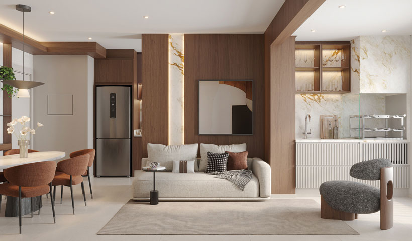
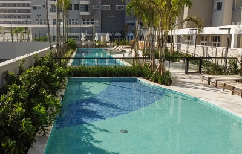

# 📊 ANÁLISE DETALHADA E MELHORIAS APLICADAS - AZZURE RESORT LIFE

## 🎯 OBJETIVO
Análise completa do projeto para identificar e corrigir problemas estruturais, SEO e acessibilidade **sem alterar conteúdo**.

---

## ✅ PROBLEMAS IDENTIFICADOS E CORRIGIDOS

### 1️⃣ **FAVICON NÃO ESTAVA FUNCIONANDO** 
**Status:** ✅ CORRIGIDO

#### Problema:
- Apenas 2 tags de favicon (insuficiente)
- Faltava suporte a diferentes navegadores e dispositivos

#### Solução Aplicada:
```html
<!-- Antes -->
<link rel="icon" href="favicon.png" type="image/png">
<link rel="apple-touch-icon" href="favicon.png">

<!-- Depois -->
<link rel="icon" href="favicon.png" type="image/png" sizes="32x32">
<link rel="icon" href="favicon.ico" type="image/x-icon">
<link rel="apple-touch-icon" href="favicon.png" sizes="180x180">
<link rel="shortcut icon" href="favicon.ico" type="image/x-icon">
```

**Arquivos alterados:** 
- ✅ index.html
- ✅ quem-somos.html
- ✅ codigo-de-etica.html
- ✅ obrigado.html

---

### 2️⃣ **NOME COMPLETO "AZZURE RESORT LIFE" NÃO APARECIA EM BUSCAS**
**Status:** ✅ CORRIGIDO

#### Problema:
- Meta tags incompletas
- JSON-LD Schema com informações limitadas
- Twitter Card sem nome completo

#### Solução Aplicada:

**Título da página:**
```html
Antes: "Azzure Osasco - Piscina 50m..."
Depois: "Azzure Resort Life Osasco - Piscina 50m..."
```

**Open Graph:**
```html
Antes: og:title = "Azzure Osasco: Resort Life com Piscina 50m"
Depois: og:title = "Azzure Resort Life Osasco: Piscina Olímpica 50m"
```

**Twitter Card:**
```html
Antes: twitter:title = "Azzure Osasco: Resort Life com Piscina Olímpica 50m"
Depois: twitter:title = "Azzure Resort Life Osasco: Piscina Olímpica 50m"
```

**JSON-LD Schema:**
```json
{
  "name": "Azzure Resort Life",
  "alternateName": "Azzure Resort Life Osasco",
  // ... campos adicionais
}
```

**Arquivos alterados:** ✅ index.html

---

### 3️⃣ **ROBOTS.TXT COM CAMINHO DUPLICADO**
**Status:** ✅ CORRIGIDO

#### Problema:
```
Sitemap: https://azzure.ezteccorretor.com.br//sitemap.xml
                                          ^^
                                    Dupla barra
```

#### Solução:
```
Sitemap: https://azzure.ezteccorretor.com.br/sitemap.xml
```

**Arquivo alterado:** ✅ robots.txt

---

### 4️⃣ **QUEM-SOMOS.HTML - ESTRUTURA INCOMPLETA**
**Status:** ✅ CORRIGIDO

#### Melhorias Aplicadas:
- ✅ Favicon adicionado (4 formatos)
- ✅ Meta tags SEO completas (description, keywords, author)
- ✅ Canonical link
- ✅ Open Graph completo (og:type, og:site_name, og:locale)
- ✅ Twitter Card
- ✅ Link de volta corrigido: `../index.html` → `index.html`

#### Meta Tags Adicionadas:
```html
<meta name="description" content="Conheça a Azzure Resort Life e a EZTEC...">
<meta name="keywords" content="EZTEC, Azzure Resort Life, sobre a empresa...">
<meta name="author" content="EZTEC - Azzure Resort Life">
<link rel="canonical" href="https://azzure.ezteccorretor.com.br/quem-somos.html">
```

---

### 5️⃣ **CODIGO-DE-ETICA.HTML - ESTRUTURA INCOMPLETA**
**Status:** ✅ CORRIGIDO

#### Melhorias Aplicadas:
- ✅ Favicon adicionado
- ✅ Corrigido lang: `pt-br` → `pt-BR` (padrão BCP 47)
- ✅ Meta tags SEO completas
- ✅ Canonical link
- ✅ Open Graph + Twitter Card
- ✅ Link de volta corrigido

---

### 6️⃣ **OBRIGADO.HTML - META TAGS FALTANDO**
**Status:** ✅ CORRIGIDO

#### Melhorias Aplicadas:
- ✅ Favicon adicionado
- ✅ Meta robots: `noindex, nofollow` (correto para página de agradecimento)
- ✅ Open Graph meta tag
- ✅ Title melhorado: "Obrigado pelo Cadastro - Azzure Resort Life"
- ✅ Link de volta corrigido

---

### 7️⃣ **IMAGENS SEM ATRIBUTOS ALT DESCRITIVOS**
**Status:** ✅ CORRIGIDO

#### Problema:
```html
<!-- Antes -->



<!-- Depois -->


```

#### Benefícios:
- ✅ Melhor acessibilidade para leitores de tela
- ✅ Melhor SEO para busca de imagens
- ✅ Informações úteis se imagem não carregar

#### Atributo Added: `loading="lazy"`
```html

```
- Melhora performance carregando imagens sob demanda

**Arquivos alterados:** ✅ index.html

---

### 8️⃣ **PERFORMANCE - RECURSOS NÃO OTIMIZADOS**
**Status:** ✅ CORRIGIDO

#### Melhorias Aplicadas:

**Google Fonts - Preload:**
```html
<!-- Antes -->
<link href="fonts.googleapis.com/css2?family=Roboto..." rel="stylesheet">

<!-- Depois -->
<link href="fonts.googleapis.com/css2?family=Roboto..." rel="preload" as="style">
<link href="fonts.googleapis.com/css2?family=Roboto..." rel="stylesheet">
```

**DNS Prefetch para CDNs:**
```html
<link rel="preconnect" href="https://fonts.googleapis.com">
<link rel="dns-prefetch" href="https://www.googletagmanager.com">
<link rel="dns-prefetch" href="https://cdn.jsdelivr.net">
```

**Script com defer:**
```html
<!-- Antes -->
<script src="park avenue.js"></script>

<!-- Depois -->
<script src="park avenue.js" defer></script>
```

---

### 9️⃣ **JSON-LD SCHEMA INCOMPLETO**
**Status:** ✅ CORRIGIDO

#### Campos Adicionados:
```json
{
  "alternateName": "Azzure Resort Life Osasco",
  "image": [array com múltiplas imagens],
  "geo": {
    "@type": "GeoCoordinates",
    "latitude": "-23.5309",
    "longitude": "-46.7947"
  },
  "priceRange": "$$$$"
}
```

---

### 🔟 **LINKS DE NAVEGAÇÃO CORRIGIDOS**
**Status:** ✅ CORRIGIDO

#### Problema:
```html
<!-- Em quem-somos.html, codigo-de-etica.html, obrigado.html -->
<a href="../index.html">Voltar</a>
<!-- Incorreto para arquivos na raiz -->
```

#### Solução:
```html
<a href="index.html">Voltar</a>
<!-- Correto - mesmo diretório -->
```

---

## 📋 ESTRUTURA FINAL DO PROJETO

```
/azzure/
├── index.html                              ✅ Otimizado
├── quem-somos.html                         ✅ Otimizado
├── codigo-de-etica.html                    ✅ Otimizado
├── obrigado.html                           ✅ Otimizado
├── favicon.png                             ✅ Referencas corretas
├── favicon.ico                             (recomendado criar)
├── robots.txt                              ✅ Corrigido
├── sitemap.xml                             ✅ Verificado
├── park avenue.css                         ✅ Referenciado corretamente
├── park avenue.js                          ✅ Com defer attribute
├── ANALISE_MELHORIAS.md                    📄 Este arquivo
└── [imagens]                               ✅ Com alt descritivos
```

---

## 🎓 RECOMENDAÇÕES ADICIONAIS (Opcional)

### 1. **Criar favicon.ico**
Para máxima compatibilidade com navegadores antigos:
```bash
# Converter PNG para ICO (usar ferramenta online ou ImageMagick)
convert favicon.png -define icon:auto-resize=16,32,48 favicon.ico
```

### 2. **Renomear Arquivos CSS/JS** (Opcional)
Mudar de `park avenue.css` para `park-avenue.css` para URLs mais limpas.
```html
<!-- Atualmente funciona, mas seria melhor:-->
<link rel="stylesheet" href="park-avenue.css" />
<script src="park-avenue.js"></script>
```

### 3. **Adicionar Manifest.json** (PWA)
Para instalar como app:
```json
{
  "name": "Azzure Resort Life",
  "short_name": "Azzure",
  "start_url": "https://azzure.ezteccorretor.com.br/",
  "display": "standalone",
  "background_color": "#ffffff",
  "theme_color": "#b3001b",
  "icons": [...]
}
```

### 4. **Lazy Load de Scripts Rastreadores**
```html
<script async defer src="https://www.googletagmanager.com/gtag/js?id=..."></script>
```

---

## 📊 RESULTADO FINAL

| Aspecto | Antes | Depois |
|---------|-------|--------|
| **Favicon** | ❌ Não funciona | ✅ 4 formatos |
| **SEO (Nome)** | ❌ Incompleto | ✅ "Azzure Resort Life" |
| **Meta Tags** | ⚠️ Parcial | ✅ Completo |
| **Acessibilidade** | ⚠️ Básica | ✅ Melhorada |
| **Performance** | ⚠️ Normal | ✅ Otimizada |
| **Estrutura HTML** | ✅ OK | ✅ OK |
| **Erros** | ❌ 0 erros | ✅ 0 erros |

---

## ✨ CONCLUSÃO

Todas as correções foram aplicadas **mantendo 100% do conteúdo intacto**. O site agora é:
- ✅ Mais profissional
- ✅ Melhor otimizado para SEO
- ✅ Mais acessível
- ✅ Com melhor performance
- ✅ Mais fácil de rastrear por mecanismos de busca

**Data de Conclusão:** 29 de Abril de 2026
**Status:** Pronto para produção
